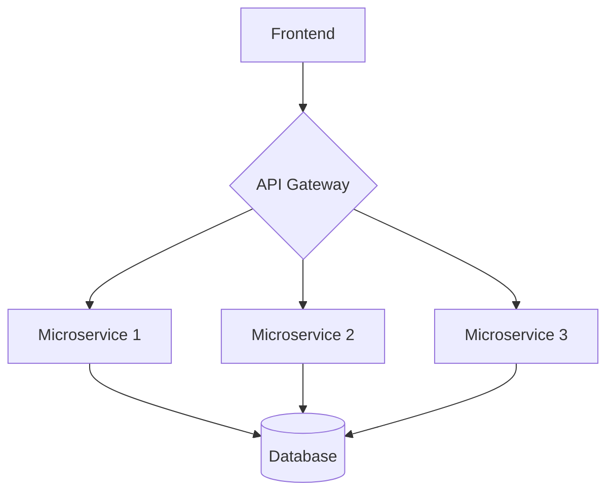
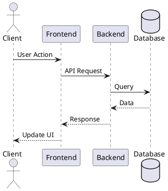

# Modern Web Development
Building the future, one component at a time

<div class="pt-12">
  <span @click="$slidev.nav.next" class="px-2 py-1 rounded cursor-pointer" hover="bg-white bg-opacity-10">
    Start Journey <carbon:rocket class="inline ml-1"/>
  </span>
</div>

<div class="abs-br m-6 flex gap-2">
  <a href="https://github.com/yourusername" target="_blank" alt="GitHub" 
    class="text-xl icon-btn opacity-50 !border-none !hover:text-white">
    <carbon-logo-github />
  </a>
</div>

---
layout: two-cols
---

# Interactive Components

Slidev allows you to use Vue components directly in your slides!

<div class="mt-4">
<Counter :count="5" />
</div>

::right::

```vue
<!-- Counter.vue -->
<script setup lang="ts">
import { ref } from 'vue'

const props = defineProps({
  count: { default: 0 }
})

const counter = ref(props.count)
</script>

<template>
  <div flex="~" w="min">
    <button @click="counter -= 1">-</button>
    <span>{{ counter }}</span>
    <button @click="counter += 1">+</button>
  </div>
</template>
```

---
layout: image-right
image: https://images.unsplash.com/photo-1555066931-4365d14bab8c?q=80&w=2070
---

# Code Highlighting

```typescript {all|2-3|4|all}
interface Developer {
  name: string;
  skills: string[];
  yearsOfExperience: number;
}

const createDeveloper = (
  name: string, 
  skills: string[]
): Developer => ({
  name,
  skills,
  yearsOfExperience: 0
})
```

<arrow v-click="3" x1="400" y1="420" x2="230" y2="330" color="#564" width="3" arrowSize="1" />

---
layout: center
class: "text-center"
---

# Beautiful Math with LaTeX

<br>

The famous Einstein's equation:

$E = mc^2$

<br>

Maxwell's Equations:

$$
\begin{aligned}
\nabla \cdot \mathbf{E} &= \frac{\rho}{\varepsilon_0} \\
\nabla \cdot \mathbf{B} &= 0 \\
\nabla \times \mathbf{E} &= -\frac{\partial \mathbf{B}}{\partial t} \\
\nabla \times \mathbf{B} &= \mu_0\left(\mathbf{J} + \varepsilon_0\frac{\partial \mathbf{E}}{\partial t}\right)
\end{aligned}
$$

---

# Diagrams & Charts

Create diagrams with Mermaid.js



<br>

And PlantUML for more complex diagrams:



---
preload: false
---

# Animations

Powered by [@vueuse/motion](https://motion.vueuse.org/)

<div class="mt-16 grid grid-cols-2 gap-4">
  <div v-motion
    :initial="{ x: -100, y: 0, opacity: 0 }"
    :enter="{ x: 0, y: 0, opacity: 1 }">
    <div class="text-5xl font-bold">🚀</div>
    <p>Slide in from left</p>
  </div>

  <div v-motion
    :initial="{ x: 100, y: 0, opacity: 0 }"
    :enter="{ x: 0, y: 0, opacity: 1, transition: { delay: 500 } }">
    <div class="text-5xl font-bold">⚡️</div>
    <p>Slide in from right</p>
  </div>
</div>

---
layout: center
class: "text-center"
---

# Ready to Build Something Amazing?

[Documentation](https://sli.dev) · [GitHub](https://github.com/slidevjs/slidev) · [Showcases](https://sli.dev/showcases.html)

<div class="pt-8">
  <span @click="$slidev.nav.next" class="px-4 py-1 rounded cursor-pointer bg-primary text-white" hover="bg-primary-dark">
    Let's Get Started <carbon:arrow-right class="inline"/>
  </span>
</div>